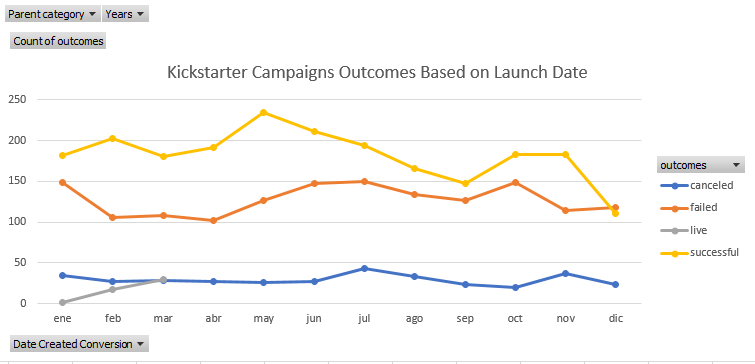
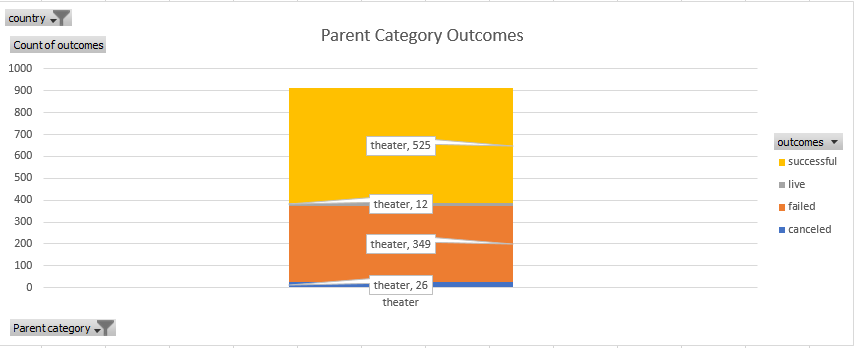
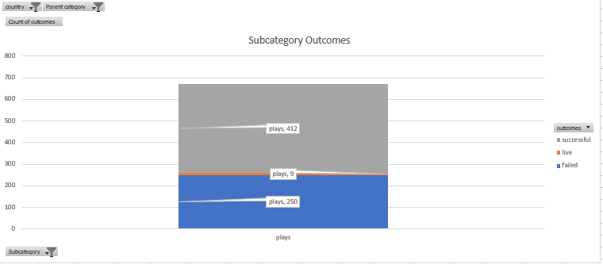
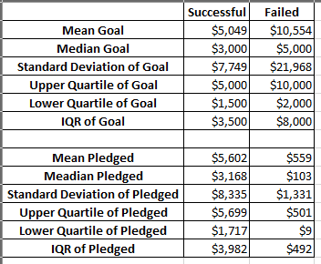

#An Analysis of Kickstarter Campaigns
Performing analysis on Kickstarter data to uncover trends.

For this project, we have Louise an up and coming playwright. Louise wants to start a crowdfunding campaign to help fund her play, Fever. She is estimating a budget of over $10000, with the database that we have been presented, we want to share meaningful insights so she can make the best decision.
With the help of Kickstarter data analytics, we count with a database with a vast range of crowdfunding categories, considering international markets from 2009 to 2017.  [kickstarter-analysis](kickstarter-analysis.xlsx)

First, let's consider time, or more specifically, whether the length of a campaign makes a difference in determining its success. We would like to know if a shorter or longer campaign is more effective, or if there is a certain time of year when campaigns tend to be more successful

The month that launched the most successful Kickstarter campaigns was May. However, January, June, July and October all had roughly the same number of failed campaigns launched, moreover, the tendency shows a noticeable decline by the end of the year.   
Next, we would like to know what the chances of her crowdfunding to be successful are. For this, we will start by dividing the category and subcategory column in different columns in the Kickstarter information so we can have this information easier to filter. Then, using pivot tables and charts, we can have a better perspective at how the categories, or in this case "parent category", behaves. Looking into the theater category, as it is the category that corresponds with Louise's, we can compute this:  

As it is her first crowdfunded play, she will be only contemplating the US. From the previous chart, we know that there is a 58% percent of probably that her project could be successful. So far, we know the theater category comprehends the musicals, plays and spaces subcategories, it would be a great idea if we go deeper, and filter the subcategory information so we have could see only the plays information. 

From the chart above, we can see that from 671 plays, 412 have a successful outcome, which represents the 61%, great news.
Finally, adding statistical components will help us deepening our analysis for Louise so we can provide an unbiased view of the data and make conclusions based on calculations. Comparing the statistics about goals from plays that succeeded versus those that failed, will help us understand the relationship between budgeting/goal and success probability. 

This simple table allows us to determine a few things. For one, failed Kickstarter campaigns have much higher fundraising goals than successful Kickstarter campaigns. Louise is asking for more than twice the average successful Kickstarter goal, so this isn't great news for her campaign. In addition, the mean and median pledged amounts are much lower than the successful pledges, which indicates that failed Kickstarter campaigns are unsuccessful for reasons other than asking for too much money. In other words, if the failed projects were also getting a median pledge amount of around $3,000, it's possible that those that failed just asked for too high of a price. Since the median is much lower, there must be another factor keeping people from pledging to those unsuccessful projects. 
The mean of each distribution is around the 3rd quartile, so the data follows similar distributions in each subset.
The standard deviations are larger than the mean, which means everything below the mean is considered "close" to the center.
Some large values are driving all of these distributions. The standard deviations are all roughly twice the IQR in each distribution, except in the failed Kickstarters, where the standard deviation is closer to three times the IQR. There must be some failed Kickstarters with really high goals!

